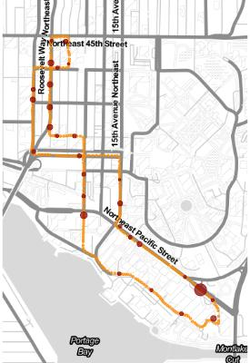

# stopr

The goal of stopr is to provide a utility function, `find_stops()`. Given 
latitude, longitude, and timestamp data from a GPS track, `find_stops()` will 
find the stops on the route and return them as a `tibble`.

## Installation

You can install the development version from [GitHub](https://github.com/) with:

``` r
# install.packages("devtools")
devtools::install_github("brianhigh/stopr")
```

## Example

This is a basic example which shows you how to use `find_stops()`:

``` r
library(readr)
library(stopr)
df <- read_csv(data_file)
stops <- with(df, find_stops(latitude, longitude, datetime,
                    stop_min_duration_s = 20, k = 5))
```

`stopr` output can be plotted on maps like the one below, showing stops 
in red, with the size of the point proportional to the duration of the stop.


